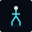
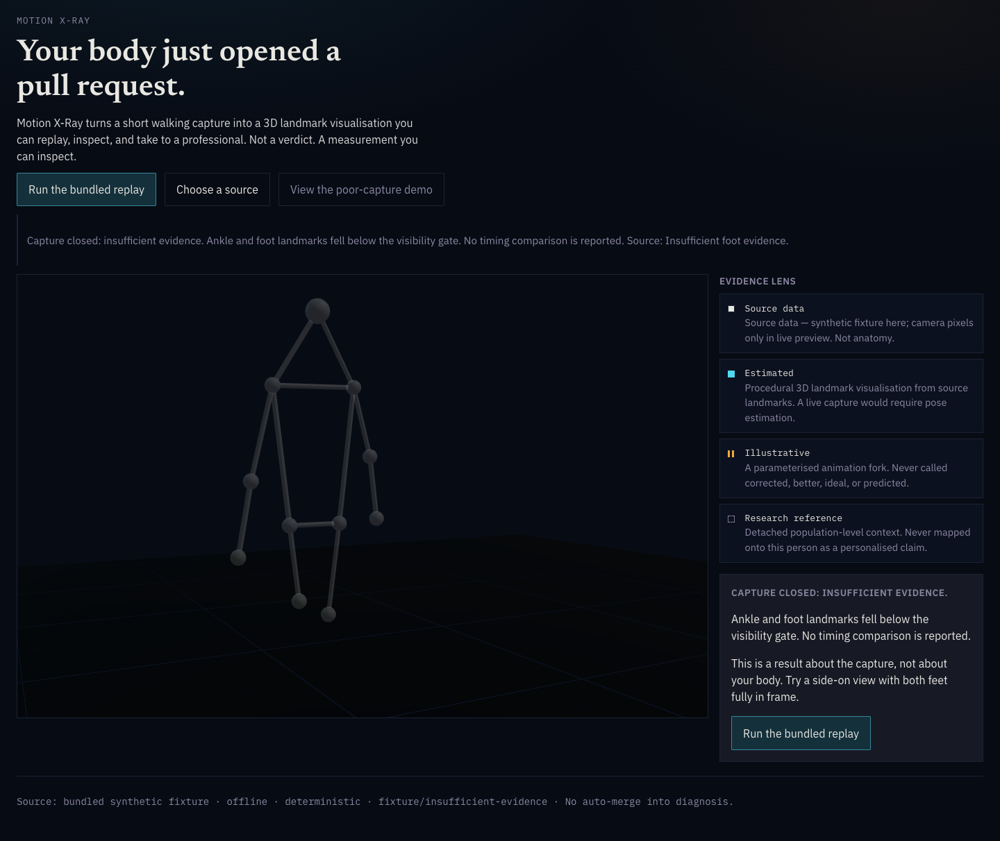
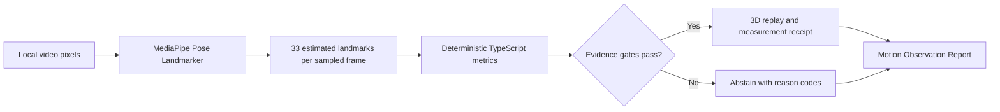
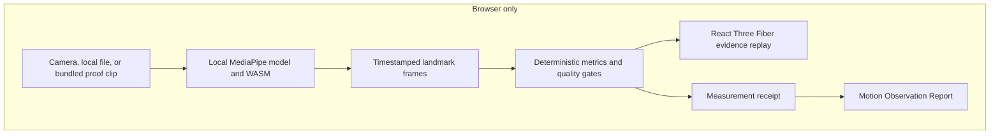

<p align="center">
  
</p>

<h1 align="center">Motion X-Ray</h1>

<p align="center"><strong>Your body just opened a pull request.</strong></p>

<p align="center">
  Turn a short walking video into an inspectable 3D motion replay, a measurement receipt,
  and a careful report to take into a conversation with a doctor or physiotherapist.
</p>

<p align="center">
  <a href="https://motion-xray.vercel.app"><strong>Open the live demo</strong></a>
</p>

<p align="center">
  
  
  
  
</p>


> [!IMPORTANT]
> Motion X-Ray is not diagnosis, medical imaging, treatment advice, a personalised anatomical model, or an injury forecast. It is a patient-generated observation tool for a better informed professional conversation.

## Why I built it

People often notice that something feels uneven before they can describe it. A phone can capture the movement, but a video alone is difficult to inspect and easy to overinterpret.

Motion X-Ray tries to make that first conversation more useful. It preserves the video-derived evidence, shows how each number was produced, exposes uncertainty, and refuses to invent a result when the capture is not good enough.

The product is intentionally modest about what one camera can know. Its value is not a dramatic health score. Its value is a clear, traceable handoff.

## What it does

1. Record a short walk, choose a local video, or run the bundled real-video proof.
2. MediaPipe Pose Landmarker estimates 33 landmarks per sampled frame inside the browser.
3. Deterministic TypeScript calculates timing, variation, capture quality, and camera-plane knee estimates.
4. A replayable 3D view links the measurements back to the observed movement.
5. A Motion Observation Report packages the capture, measures, quality, method, limitations, and useful questions for a professional.
6. If the evidence gates fail, the app withholds the unsupported outputs and explains why.

No upload. No backend. No hidden language-model interpretation in the measurement path.

## The output

| Layer | What it contains | Why it exists |
|---|---|---|
| 3D evidence replay | Orbitable landmarks, source-linked playback, event ribbon, and evidence lens | Lets a person inspect the movement behind the number |
| Measurement receipt | Frame count, visibility, accepted and rejected events, regularity, model identity, and checksum | Makes the calculation traceable |
| Motion Observation Report | Capture record, observed measures, artefacts, unavailable context, provenance, and questions | Gives a professional a concise starting point without pretending to reach a clinical conclusion |


The report is **CMAS-informed in structure**, not CMAS-accredited, compliant, clinically validated, or professionally signed. The reporting rationale is documented in [docs/clinical-reporting-basis.md](docs/clinical-reporting-basis.md).

## Evidence accepted, or honestly refused

<table>
  <tr>
    <td width="50%"></td>
    <td width="50%"></td>
  </tr>
  <tr>
    <td><strong>Accepted</strong><br />Real pixels become estimated landmarks, deterministic measures, and an inspectable replay.</td>
    <td><strong>Refused</strong><br />Poor visibility closes the analysis with reason codes instead of a confident-looking guess.</td>
  </tr>
</table>

The bundled 11.88 second proof clip travels through the same local-video pipeline as a user-selected file. It does not load precomputed landmarks or special-case an expected answer.

## A reproducible browser result

The one-click real-video path produced this receipt during release verification:

| Evidence | Observed result |
|---|---:|
| Capture gate | `accepted` |
| Sampled frames | 238 |
| Analysed duration | 11,850 ms |
| Pose presence | 0.9958 |
| Mean foot visibility | 0.9374 |
| Accepted events | 11 left, 11 right |
| Rejected events | 0 |
| Frame gaps | 0 |
| Teleport frames | 0 |
| Alternation score | 1.0 |
| Median same-side interval | 1,050 ms left, 1,050 ms right |
| Camera-plane knee range | 42.4 degrees left, 49.9 degrees right |

A poor-capture control returned `poor-foot-visibility` and `insufficient-events-per-side`, then withheld the timing comparison.

## Measurement integrity

The language model does not create the measurements.



Every accepted result exposes the source kind, trace ID, sampled frames, duration, pose presence, foot visibility, candidate and rejected events, frame gaps, discontinuities, interval variation, model identity, and model checksum.

The public receipt excludes raw frames, landmarks, pixels, filenames, paths, blobs, and object URLs.

### Evidence classes

| Class | Meaning |
|---|---|
| Source data | Camera or video pixels, or a clearly labelled synthetic test fixture |
| Estimated | MediaPipe normalized landmarks and hip-origin world estimates |
| Calculated | Deterministic fields derived from those landmarks |
| Illustrative | A visually distinct animation fork with a stated display parameter |
| Unavailable | Forces, tissue stress, personalised anatomy, diagnosis, and future outcomes |

This visual grammar is part of the safety design. Captured evidence should not quietly become anatomy, and an illustration should not quietly become prognosis.

## Scientific scope

Motion X-Ray deliberately reports less than a gait laboratory.

| Reported | Not claimed |
|---|---|
| Same-side heel-low event interval estimate | A clinically validated heel strike |
| Interval spread and left-to-right delta | Normality, abnormality, or a reference-population judgement |
| Camera-plane knee flexion range estimate | Clinical range of motion or calibrated 3D joint kinematics |
| Pose presence, visibility, gaps, and discontinuities | Ground reaction force, moment, muscle activity, tissue load, pain, diagnosis, or prognosis |
| Capture and method provenance | Treatment advice or a claim about what caused an observed difference |

Structured video observation can support professional reasoning, but reliability depends on protocol, expertise, and validation. Motion X-Ray packages observations for professional review instead of automating the professional conclusion.

## Architecture



- React 19, TypeScript, and Vite
- Three.js through React Three Fiber and Drei
- `@mediapipe/tasks-vision@0.10.17`
- Local Pose Landmarker model and SIMD or non-SIMD WASM
- Immutable reducer, one replay clock, no router, no backend, no analytics
- Seeded synthetic fixtures for deterministic regression tests

## Run locally

Requirements: Node.js 20 or newer and a modern browser with WebAssembly support.

```bash
npm install
npm run dev
```

Open `http://127.0.0.1:5173/`, then select **Run real video proof**.

To verify the release:

```bash
npm test
npm run lint:claims
npm run build
```

The current suite contains 61 tests across numerical behaviour, determinism, state transitions, capture lifecycle, adversarial quality cases, receipt privacy, report mapping, and product-language claims.

## How Codex changed the build

This project crossed computer vision, biomechanics research, 3D interaction, privacy, scientific communication, adversarial testing, and release engineering. That is usually months of sequential work.

I used Codex as an engineering partner across those boundaries. It helped investigate primary literature and open-source motion stacks, challenge unsafe product claims, turn the viable idea into a typed measurement contract, implement the browser pipeline, test failure modes, and verify the visible product. Most importantly, it made the uncertainty executable: unsupported language fails a claims lint, weak captures abstain, and every result carries a receipt.

The leverage was not simply writing more code. It was keeping research, product judgement, implementation, testing, and evidence in one tight loop while the idea changed underneath us.

## Project map

```text
src/
  app/          state and capture orchestration
  copy/         centralized, linted product language
  fixtures/     typed accepted and abstention controls
  live/         camera, file, model, clock, and provenance paths
  metrics/      event detection, timing, quality, receipt, and fork logic
  scene/        3D skeleton, trails, pulses, floor, and camera
  ui/           evidence lens, body diff, receipt, report, and source picker
tests/          numerical, lifecycle, quality, adversarial, and claims tests
public/
  models/       local Pose Landmarker model
  mediapipe/    local WASM runtime
  demo/         licensed real-video proof clip and attribution
docs/           scientific rationale and curated product evidence
```

## Privacy and limitations

- Camera and selected-video pixels remain in the browser.
- There is no account, backend, analytics, or upload path.
- One monocular camera cannot establish kinetics, tissue state, personalised anatomy, or causation.
- World landmarks are MediaPipe hip-origin estimates centred for display.
- Knee values are 2D camera-plane estimates.
- Heel-low events are a prototype temporal proxy, not validated gait-lab heel strikes.
- One accepted capture does not establish between-session repeatability.
- The current report is a patient-generated observation, not a clinical gait analysis report.
- The project has not undergone clinical validation, regulatory review, privacy certification, or production-readiness assessment.

## References

- [Clinical Movement Analysis Society Standards, 2021](https://cmasuki.org/wp-content/uploads/2021/08/CMAS-Standards-2021-v15.pdf)
- [MediaPipe Pose Landmarker for Web](https://developers.google.com/edge/mediapipe/solutions/vision/pose_landmarker/web_js)
- [Reliability of videotaped observational gait analysis in orthopaedic impairments](https://doi.org/10.1186/1471-2474-6-17)
- [GAMMA recommendations for clinical movement-analysis laboratories](https://doi.org/10.1016/j.gaitpost.2024.11.018)
- [Sports2D](https://github.com/davidpagnon/Sports2D)
- [OpenCap](https://github.com/opencap-org/opencap-core)
- [HL7 FHIR Observation](https://hl7.org/fhir/R4/observation.html), a future interoperability direction, not a conformance claim

## Attribution

The bundled walk clip is used under the [Mixkit Stock Video Free License](https://mixkit.co/license/). Full source details are in [public/demo/ATTRIBUTION.md](public/demo/ATTRIBUTION.md). MediaPipe Tasks Vision and its Pose Landmarker model are distributed under Apache 2.0. Newsreader, IBM Plex Sans, and IBM Plex Mono use the SIL Open Font License.

Motion X-Ray will not tell you what is wrong with your body. It will show you what the camera captured, what the model estimated, what the code calculated, what the evidence could not support, and what may be worth asking a professional.

**Not a verdict. A measurement you can inspect.**
