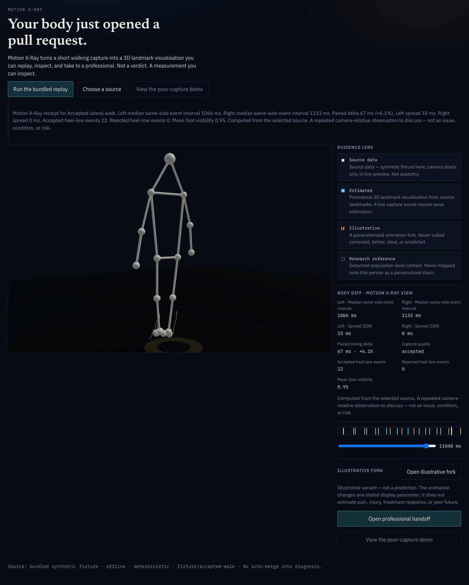
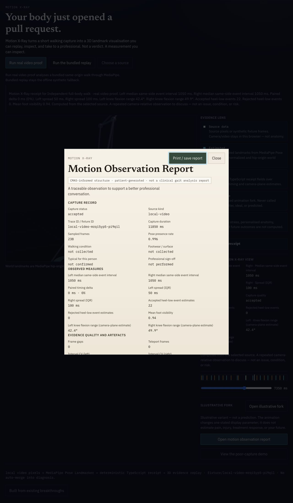
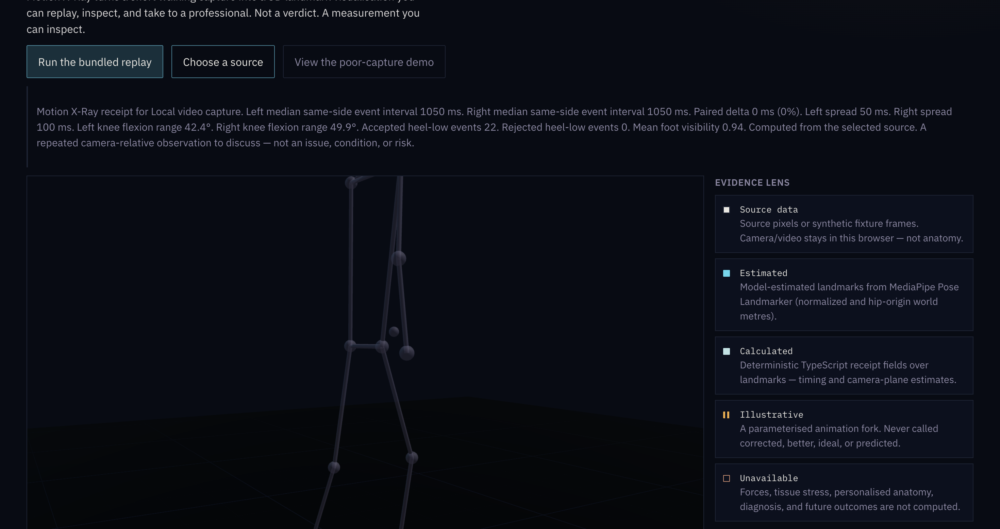
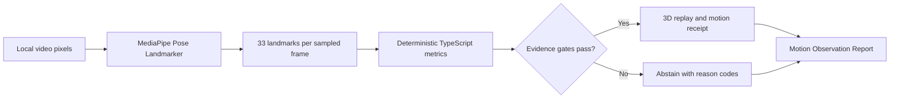
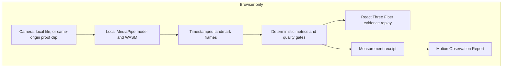

<p align="center">
  
</p>

<h1 align="center">Motion X-Ray</h1>

<p align="center"><strong>Your body just opened a pull request.</strong></p>

<p align="center">
  A short walking video becomes a local 3D landmark replay, an inspectable motion receipt,
  and a clinician-readable observation report. When the capture is weak, the app refuses to invent a result.
</p>

<p align="center">
  
  
  
  
</p>



> [!IMPORTANT]
> Motion X-Ray is not diagnosis, medical imaging, treatment advice, a personalised anatomical model, or an injury forecast. It is a patient-generated observation tool designed to help a professional conversation begin with better evidence.

## The idea in 20 seconds

1. Click **Run real video proof**, choose a local video, or use the camera.
2. MediaPipe Pose Landmarker estimates 33 landmarks per sampled frame inside the browser.
3. Deterministic TypeScript calculates capture-relative timing, variation, quality, and camera-plane knee estimates.
4. A replayable 3D view shows what was measured.
5. A **Motion Observation Report** packages the result, capture conditions, uncertainty, method, and questions for a doctor or physiotherapist.
6. If evidence gates fail, timing and knee outputs are withheld.

No video upload. No hidden model interpretation. No confident paragraph wrapped around a guess.

## The outcome

The output is not a posture score. It is a traceable handoff with three layers.

| Layer | What the user receives | Why it matters |
|---|---|---|
| 3D evidence replay | An orbitable landmark figure, event ribbon, and source-linked playback | The number can be inspected against the movement |
| Measurement receipt | Frame count, pose presence, visibility, accepted and rejected events, regularity, model identity, and checksum | The result carries evidence about how it was produced |
| Motion Observation Report | Capture record, observed measures, quality and artefacts, unavailable context, method provenance, and questions for a professional | A doctor or physiotherapist gets a concise starting point, not an AI conclusion |

The report structure is informed by the [Clinical Movement Analysis Society standards](https://cmasuki.org/wp-content/uploads/2021/08/CMAS-Standards-2021-v15.pdf). CMAS expects clinical reports to preserve capture conditions, typicality, artefacts, traceable trials, units, processing details, reference data, and accountable sign-off. Motion X-Ray exposes those fields and marks unavailable items honestly. It does **not** claim CMAS accreditation, compliance, clinical validation, or professional sign-off.



## What judges can see

<table>
  <tr>
    <td width="50%"></td>
    <td width="50%"></td>
  </tr>
  <tr>
    <td><strong>Evidence accepted</strong><br />Real pixels become a 3D replay and deterministic receipt.</td>
    <td><strong>Evidence refused</strong><br />Poor foot visibility closes the analysis without a timing claim.</td>
  </tr>
</table>

The demo includes a licensed, same-origin 11.88 second full-body walking clip. The **Run real video proof** action fetches that MP4 into a browser `File` and sends it through the exact local-video pipeline. It does not load precomputed landmarks or special-case the expected result.

## Real browser result

The complete one-click path was verified in the visible Codex in-app browser on 2026-07-18.

| Evidence | Observed result |
|---|---:|
| Capture gate | `accepted` |
| Sampled frames | 238 |
| Analysed duration | 11,850 ms |
| Pose presence | 0.9958 |
| Mean foot visibility | 0.9374 |
| Candidate and accepted events, left | 11 / 11 |
| Candidate and accepted events, right | 11 / 11 |
| Rejected events | 0 |
| Frame gaps | 0 |
| Teleport frames | 0 |
| Alternation score | 1.0 |
| Left interval CV | 0.1135 |
| Right interval CV | 0.1628 |
| Left median same-side interval | 1,050 ms |
| Right median same-side interval | 1,050 ms |
| Camera-plane knee range | 42.4 degrees left, 49.9 degrees right |

A built-in poor-capture control returned `poor-foot-visibility` and `insufficient-events-per-side`. The app withheld the timing comparison. Full evidence is preserved in [BROWSER_PROOF.md](BROWSER_PROOF.md).

## Why this is not AI slop

The language model never creates the measurements.



Every accepted result exposes:

- the exact source kind and trace ID
- sampled frames and capture duration
- pose presence and mean foot visibility
- candidate, accepted, and rejected event estimates by side
- frame gaps, teleport frames, interval CVs, and alternation
- the MediaPipe package and model identity
- the model SHA-256 checksum
- an explicit list of what the capture cannot establish

The public JSON receipt excludes raw frames, landmarks, source pixels, filenames, paths, blobs, and object URLs.

## Evidence classes

The interface uses a visible evidence grammar.

| Class | Meaning |
|---|---|
| Source data | Camera or video pixels, or a labelled synthetic fixture |
| Estimated | MediaPipe normalized landmarks and hip-origin world metre estimates |
| Calculated | Deterministic fields calculated over those landmarks |
| Illustrative | A dotted amber animation fork with one stated display parameter |
| Unavailable | Forces, tissue stress, personalised anatomy, diagnosis, and future outcomes |

The visual distinction is part of the product. Captured evidence should not quietly turn into anatomy, and an illustrative animation should not quietly turn into prognosis.

## Scientific scope

Motion X-Ray deliberately reports less than a gait laboratory.

| Reported | Not reported, and why |
|---|---|
| Same-side heel-low event interval estimate | Heel strike, because the event detector has not been validated against force plates |
| Interval spread and left/right delta | A normal or abnormal judgement, because no validated reference population is applied |
| Camera-plane knee flexion range estimate | Clinical range of motion or 3D joint kinematics |
| Pose presence, visibility, frame gaps, discontinuities | Ground reaction force, moment, muscle activity, tissue load, pain, diagnosis, or prognosis |
| Capture traceability and method provenance | Treatment recommendation or a claim about what caused an observed difference |

This boundary follows the evidence. Structured video gait observation can support clinical reasoning, but published studies show that reliability varies and improves only with protocol, structure, expertise, and validation. The app therefore packages observations for professional review instead of automating the professional conclusion.

Key references:

- [Clinical Movement Analysis Society Standards, 2021](https://cmasuki.org/wp-content/uploads/2021/08/CMAS-Standards-2021-v15.pdf)
- [MediaPipe Pose Landmarker for Web](https://developers.google.com/edge/mediapipe/solutions/vision/pose_landmarker/web_js)
- [Reliability of videotaped observational gait analysis in orthopaedic impairments](https://doi.org/10.1186/1471-2474-6-17)
- [Sports2D: markerless kinematics from video](https://github.com/davidpagnon/Sports2D)
- [OpenCap: smartphone videos to movement dynamics](https://github.com/opencap-org/opencap-core)
- [HL7 FHIR Observation](https://hl7.org/fhir/R4/observation.html), a future interoperability direction, not a current conformance claim

## How Codex made this possible

The unusual part is not that an agent wrote React. The unusual part is the amount of multidisciplinary work compressed into one build day without hiding the uncertainty.

Codex acted as the instrument factory and verification lead:

1. It researched gait science, clinical reporting standards, competing products, and open-source motion stacks.
2. It rejected the original diagnosis and injury-prediction direction because the sensor could not support those claims.
3. It converted the viable wedge into a frozen Fable specification and typed measurement contract.
4. It wrote staff-level implementation briefs for a fast Cursor Grok worker.
5. It independently exercised the real app in headed Chromium and the visible Codex browser.
6. It found real failures in timestamp handling, missing-pose preservation, event undercounting, and receipt inspectability.
7. It used positive, negative, repeated-run, shuffled, constant, random, and truncated controls to force corrections.
8. It added a context-aware claims linter so unsafe product language fails the build.

That separation matters. The implementation worker produced code quickly. Codex remained responsible for the product contract, source boundaries, adversarial review, browser proof, and release evidence.

> Codex compressed months of open-source research, perception integration, 3D product engineering, and adversarial testing into one build day. It did not compress the standard of evidence.

The staff briefs, corrections, and receipts are intentionally committed. Start with [FABLE_SPEC.md](FABLE_SPEC.md), [CLINICAL_REPORTING_BASIS.md](CLINICAL_REPORTING_BASIS.md), [BUILD_RECEIPT.md](BUILD_RECEIPT.md), and [MANIFEST.md](MANIFEST.md).

## Architecture



- React 19, TypeScript, and Vite
- Three.js through React Three Fiber and Drei
- `@mediapipe/tasks-vision@0.10.17`
- Bundled `pose_landmarker_full.task` and local SIMD or non-SIMD WASM
- Immutable reducer, one replay clock, no router, no backend, no analytics
- Seeded synthetic fixtures for deterministic fallback and regression tests

## Run locally

Requirements: Node.js 20 or newer and a modern browser with WebAssembly support.

```bash
npm install
npm run dev
```

Open `http://127.0.0.1:5173/`, then select **Run real video proof**.

Production build:

```bash
npm run build
npm run preview
```

Verification:

```bash
npm test
npm run lint:claims
npm run build
```

Fixture regeneration is deterministic:

```bash
npm run generate:fixtures
```

## Project map

```text
src/
  app/          immutable state and capture orchestration
  copy/         centralized, linted product language
  fixtures/     typed accepted and abstention controls
  live/         camera, file, model, clock, and provenance paths
  metrics/      event detection, timing, quality, receipt, and fork logic
  scene/        3D skeleton, trails, pulses, floor, and camera
  ui/           evidence lens, body diff, receipt, report, and source picker
tests/          numerical, lifecycle, quality, adversarial, and claim tests
public/
  models/       local Pose Landmarker model
  mediapipe/    local WASM runtime
  demo/         licensed real-video proof clip and attribution
browser-proof/  headed browser screenshots
```

## Known limitations

- No clinical validation, regulatory review, privacy certification, or production-readiness claim
- One monocular camera cannot establish kinetics, tissue state, personalised anatomy, or causation
- World landmarks are MediaPipe hip-origin estimates centred for display
- Knee values are 2D camera-plane estimates
- Heel-low events are a prototype temporal proxy, not validated gait-lab heel strikes
- A single accepted capture does not establish between-session repeatability
- The current report is CMAS-informed in structure, not a CMAS clinical report
- The main JavaScript chunk is large because the product keeps inference assets local

## Privacy

- Camera and selected-video pixels remain in the browser
- No backend, account, tracking, or upload path exists
- Public receipts exclude raw media and landmarks
- Development-only fixture inspection is removed from the production bundle

## Licence and attribution

- React, Vite, Three.js, React Three Fiber, and Drei: MIT
- IBM Plex Sans, IBM Plex Mono, and Newsreader: SIL Open Font License
- MediaPipe Tasks Vision and Pose Landmarker model: Apache 2.0
- Demo walk clip: [Mixkit Stock Video Free License](https://mixkit.co/license/), with full details in [public/demo/ATTRIBUTION.md](public/demo/ATTRIBUTION.md)
- Synthetic fixture data: generated in this repository and not derived from an identifiable person

## The promise

Motion X-Ray will not tell you what is wrong with your body.

It will show you what the camera captured, what the model estimated, what the code calculated, what the evidence could not support, and what may be worth asking a professional.

**Not a verdict. A measurement you can inspect.**

**No auto-merge into diagnosis.**
